# System Perspective

In this chapter, we will first present a high-level overview of the system architecture using a simplified version of the [4+1 Architectural model by P.B. Kruchten](https://www.cs.ubc.ca/~gregor/teaching/papers/4+1view-architecture.pdf). Then, we will present the design of some core components of the system, followed by a complete listing of dependencies and tools used for development, maintenance, and monitoring. Next, we will describe our monitoring and logging setup. Lastly, we will comment on the current state of our system.

## Architecture

In the following 4+1 Architectural model, we have omitted two views: the *Use Case View* and the *Logical View*. The *Use Case View* is omitted as the use cases for MiniTwit were presented to all students in class and were required to remain unchanged. The *Logical View* is omitted as most of our code is organized as a set of functions and not as objects/classes. The concrete design of the system will, however, be elaborated upon in the *Design* section.

### Physical View

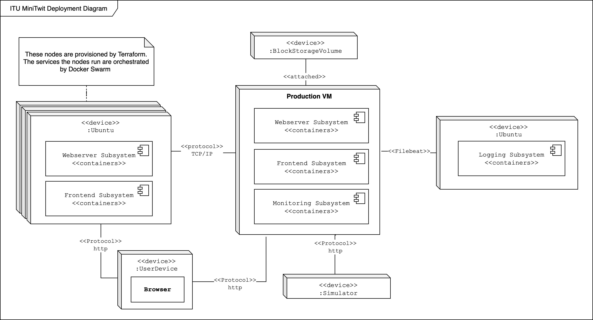  
**Figure 1:** The physical view of the MiniTwit system illustrated with an UML deployment diagram.

Figure 1 illustrates the physical view of the MiniTwit system, i.e., which nodes/virtual machines host which subsystems. We see that the `Webserver` and `Frontend` subsystems, which make up the application, have been replicated across several nodes by the cluster management tool, *Docker Swarm*, which we will elaborate on in the *Docker Swarm – Scaling and Load Balancing* section. The nodes themselves are provisioned by *Terraform*. It should be noted that the different components in every subsystem is encapsulated in separate Docker containers.

The nodes in the Swarm setup have access to a special node named *Production VM*, which runs a *PostgreSQL* database for data persistence and retrieval. The Production VM stores this data on an attached [*DigitalOcean Block Storage Volume*](https://www.digitalocean.com/docs/volumes/). We created a [C*loud Firewall*](https://www.digitalocean.com/docs/networking/firewalls/) on DigitalOcean such that only nodes in the Swarm setup can access the Production VM (as described in [this pull request](https://github.com/DevOps-Drengene/DevOps-Project/pull/189)). The Production VM also runs the `Webserver` and `Frontend` subsystems such that it can additionally function as a regular node from the cluster. Furthermore, the Production VM runs the `Monitoring` subsystem to monitor several metrics, which we will elaborate on in the *Monitoring* section.

A special node running the `Logging` subsystem filters and stores logs sent by *[Filebeat](https://www.elastic.co/beats/filebeat)* from the Production VM. Finally, we see users interacting with the Swarm setup (or Production VM) using their browser, while the simulator only interacts with the Production VM.

#### Docker Swarm – Scaling and Load Balancing Strategy

Up until session 11, we hosted the complete production MiniTwit system, including `Webserver` subsystem and database, solely on the Production VM, and the `Logging` subsystem on a separate virtual machine. These machines have only been possible to scale vertically, and it has been necessary a couple of times to increase the amount of memory and disk capacity of the machines. For the load balancing strategy of this setup, no load balancing was required as no replicated setup of the machines was implemented.

This setup has several flaws. First, it forms a single point of failure as the `Webserver` subsystem and database is hosted on a single machine. Secondly, by having the database hosted on the same machine as the application subsystems, it gets complex to replicate the instances of the subsystems hosted on additional machines without replicating the database too. This situation would introduce complex data consistency challenges.

Following session 11, we implemented a Docker Swarm setup alongside the existing setup to experiment with horizontal scaling and a more available system. We decided to extend the full setup provided by the course to make it fit our specific purposes. This setup can be found [here](https://github.com/DevOps-Drengene/itu-minitwit-docker-swarm-terraform). Due to time constraints, we only got to run a few less critical subsystems of the MiniTwit system as services in the Swarm setup. By less critical, it is meant that the system would still be able to partially function and process requests from the simulator without these subsystems. The subsystems hosted in the Swarm setup includes the `Frontend` subsystem and `Webserver` subsystem. Additionally, we estimated that it would take too much time to reimplement the logging and monitoring solution tailored to the Production VM to a more complex distributed setup with more machines, and it has therefore not been done.

The Swarm setup consists of five nodes (virtual machines) in total, where two nodes are assigned to be *worker nodes*, and the rest are *manager nodes* with one elected leader. This setup should, according to [the official documentation](https://docs.docker.com/engine/swarm/admin_guide/#add-manager-nodes-for-fault-tolerance), tolerate a failure of two manager nodes and remain available to process requests.

For pure experimental purposes, the subsystems mentioned earlier are replicated as services in the Swarm setup as listed below:

- `Frontend` subsystem: 2 replicas
- `Webserver` subsystem: 5 replicas

For the load balancing strategy, we use the built-in functionality of *[ingress load balancing](https://docs.docker.com/engine/swarm/key-concepts/#load-balancing)* in Docker Swarm. In essence, any request to any specific service in the Swarm setup is automatically routed to any node running the task for the specific service.

For public access to the services in the setup, we decided to assign a [*floating IP*](https://www.digitalocean.com/docs/networking/floating-ips/) (reassignable static IP on DigitalOcean) to the node that is initially elected as leader manager. In retrospect, this design is quite faulty as the leader node might fail, whereby there is no access to the Swarm even though other nodes with different IPs could handle the request. One solution would be to add an external load balancer, which would route requests randomly to any node in the Swarm setup, and assign the floating IP to the load balancer.

### Development View

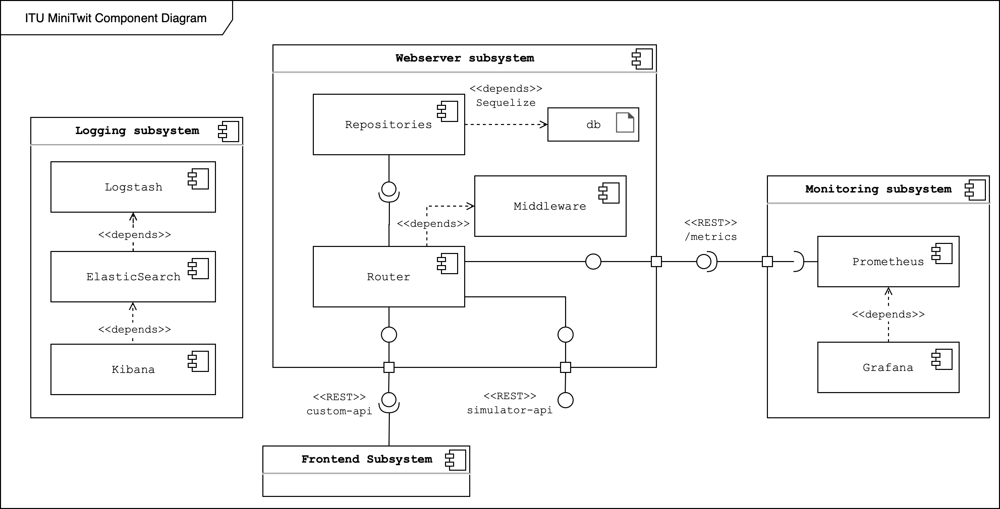  
**Figure 2:** The development view of the MiniTwit system illustrated with an UML component diagram.

The development view shows the major subsystems, their internal components, and their dependencies. The central `Webserver` subsystem exposes a set of *REST API* endpoints for the use of other subsystems such as the `Frontend` subsystem. It should be noted that the two APIs (labelled `simulator-api` and `custom-api` in Figure 2) are almost identical. The API that the simulator uses did not correspond well to how the front-end was supposed to behave, which led us to create the `custom-api` for better interoperability. The simulator uses the API labelled `simulator-api`.

The central `Webserver` subsystem is mainly a Node.js + Express application consisting of three major components in order to separate concerns:

1.  `Repositories` component: reads and writes models to the database using the *object-relational mapping* (ORM) tool, Sequelize, which is configured in the `[db.js](https://github.com/DevOps-Drengene/DevOps-Project/blob/master/backend/src/config/db.js)` file and exposes these models for consumption via its API.
2.  `Router` component: defines the API endpoints and implements business logic to serve users, the simulator and the `Monitoring` subsystem. The component uses the API exposed by the `Repositories` component.
3. `Middleware` component: Contains functions that are executed upon each request to specific API endpoints. This includes authentication, error handling, and logging.

The `Monitoring` subsystem uses the `/metrics` endpoint for the collection of monitoring data, e.g., CPU usage, number of requests to different routes and their respective response times. We elaborate on the monitoring setup in the *Monitoring* section.

The `Frontend` subsystem is a React application that provides the *graphical user interface* (GUI) through which the users interact with the `Webserver` subsystem.

We will elaborate on the `Logging` subsystem in the *Logging* section.

### Process View

In this section, we describe how the major subsystems interact. This is illustrated by two UML diagrams.

Figure 3 shows the interaction between subsystems when a user sends a request using the `Frontend` subsystem, while Figure 4 illustrates the continuous monitoring of the Production VM metrics.

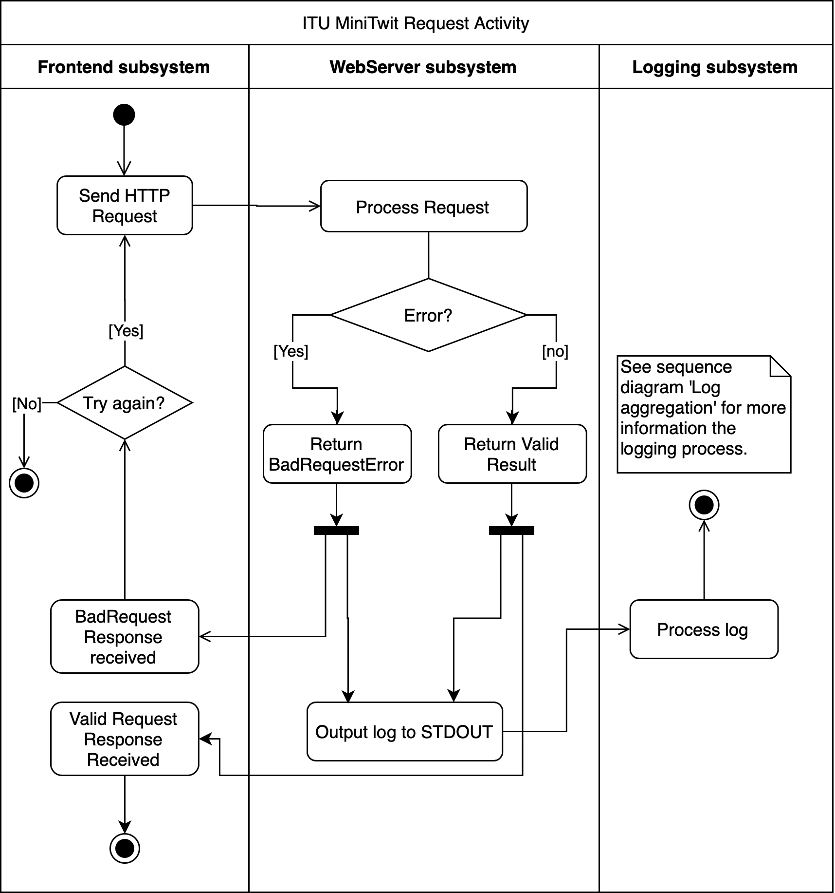  
**Figure 3:** How subsystems interact when a user creates a request using the `Frontend` subsystem.

When the user makes a request using the `Frontend` subsystem, the request is sent using HTTP. This request is processed by the `Webserver` subsystem, which either produces an error or a valid result. If an error is produced, a `BadRequestResponse` is sent back to the `Frontend` subsystem with a description of the error. Otherwise, the `Frontend` receives the `ValidRequestResponse` and updates the UI accordingly. In any case, the `Webserver` subsystem outputs the result of the request to standard output (STDOUT). Filebeat then sends this log to the `Logging` subsystem for processing.

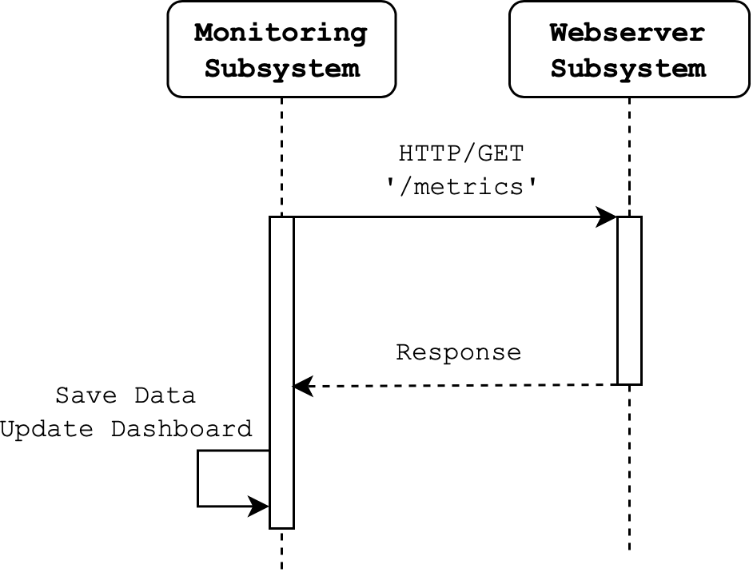  
**Figure 4:** How the subsystems `Monitoring` and `Webserver` interact

While the `Webserver` subsystem serves users, the `Monitoring` subsystem queries the `Webserver` on the `/metrics` endpoint to gather current metrics of the node, namely the Production VM, on which the `Webserver` subsystem is hosted. We elaborate on the monitoring setup in the *Monitoring* section.

## Design

The system is a rather standard setup, where each subsystem has its own responsibility and is only loosely coupled to the other subsystems. As presented in *Development View,* the system is divided into `Frontend` subsystem, `Webserver` subsystem, `Logging` subsystem, `Monitoring` subsystem, and `db` component. This section will firstly briefly describe the chosen technologies and then move on to describe the design of our simulator API.

### Technologies

**React**  
As we were to develop a web application, we chose to go with the most popular JavaScript (or, *the programming language of the web*, as one team member likes to call it) library for building such: *React*. Coincidentally, this is also a library that multiple of the team members have worked with before and are comfortable developing in, making it an obvious choice.

**Node.js (Node)**  
For maintainability and developer efficiency reasons, we chose to code the back-end in the same programming language as the front-end. As the front-end is written in JavaScript, that means *Node* for the back-end.

**Express**  
*Express* is the most popular web application framework for Node with [48.5k stars on GitHub](https://github.com/expressjs/express), and is therefore an obvious go-to when building a web server in Node. It is the software that allows us to handle HTTP requests and is as such essential to our system.

**PostgreSQL**  
As the data to be stored is relational in nature, we had to find a robust and scalable *Relational Database Management System* (RDMS) that, unlike *SQLite*, supports concurrent reads and writes. The choice stood between *MySQL* and *PostgreSQL*. PostgreSQL is in the writers' experience the most popular for the time being and was therefore appointed the winner.

The database contains tables for users, messages and follows, respectively. A *follow* is an aggregation of two users that are used to determine which messages should show up in any given user's feed.

**Sequelize**  
*Sequelize* is a popular ORM for Node. Using an ORM has several advantages, the most prominent in our case being that it loosens the coupling between the database and the web server. Sequelize allows us to swap PostgreSQL with another SQL-based RDMS without having to change more than a single variable in the source code. Furthermore, Sequelize provides support for using migrations which significantly increases the efficiency of refactoring the database during production. We did not, however, use migrations in this project.

**Docker Compose**  
*Docker Compose* is a tool used to orchestrate an array of Docker containers, which among other things allows them to communicate with each other. One specifies the entire setup in a configuration file, which can then be used both locally, in the CI/CD pipeline and on the Production VM, meaning the repeatability of the setup is excellent. Furthermore, the complexity of running the system is greatly reduced, as the developer simply has to type `docker-compose up` to spin up the entire system. Our configuration for spinning up the project locally can be seen [here](https://github.com/DevOps-Drengene/DevOps-Project/blob/master/docker-compose.yml), and the production configuration, which extends the aforementioned configuration, can be seen [here](https://github.com/DevOps-Drengene/DevOps-Project/blob/master/docker-compose.prod.yml).

**Docker Swarm**  
*Docker Swarm* is used for replicating services across multiple hosts to allow for better scalability. See the section *Docker Swarm – Scaling and Load Balancing* for more information on our specific usage.

**DigitalOcean**  
We chose *DigitalOcean* as our cloud provider, as it seemed easy to get started with, and it gives some free credits to play around with. It's built around *Droplets*, which are just virtual machines. Many different configurations are available and it is possible to add detachable Block Storage volumes to the Droplets.

### Design of the Simulator API

We have chosen to dive into the design of the simulator API, as this is the central part of the system.

Our API catering to the simulator is an Express server that exposes four endpoints: `/register`, `/msgs`, `/fllws`, and `/latest`.  `/register` is used to register a new MiniTwit user, `/msgs` is used for message-related activities, `/fllws` is used for actions related to users following each other, and `/latest` provides the current value of the `latest` variable. For further documentation of our API, we refer to our [Swagger documentation](http://157.245.27.128:5001/api-docs/).

We have utilized the *[Repository Pattern](https://deviq.com/repository-pattern/)* to abstract the communication with the database away from the routes themselves. Also, using this pattern allowed us to atomically test each part of the system, e.g., test the routes without testing the database. The repositories themselves use Sequelize to communicate with the database (see why in the paragraph on Sequelize above). This general structure is shown in Figure 5.

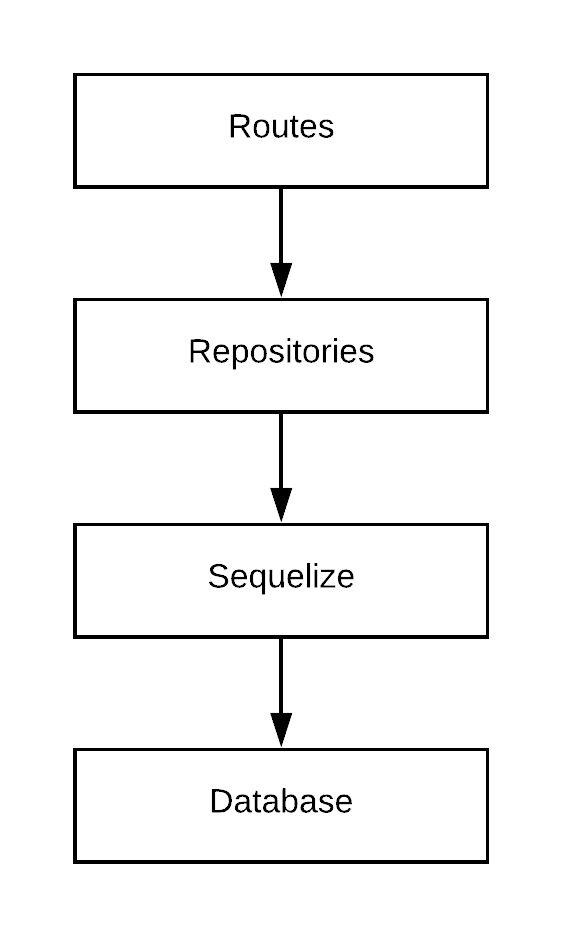  
**Figure 5:** The request flow from routes to the database.

Figure 6 presents the layout of all the internal (i.e., excluding external dependencies) code artifacts that make up the simulator API. 

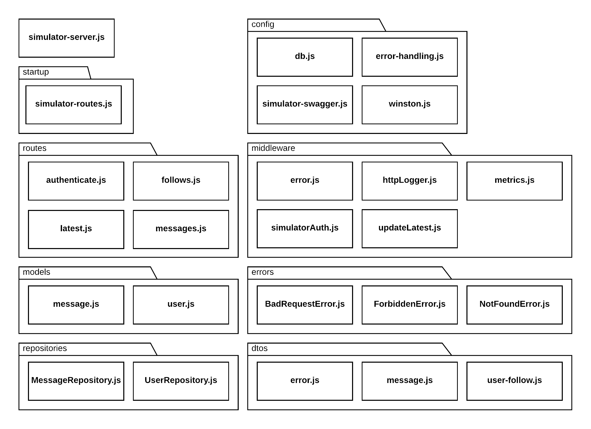  
**Figure 6:** The structure of the code artifacts comprising the simulator API. The package that every file is in corresponds to their folder in the code repository. The `simulator-server.js` is outside of a package, which indicates that it is in the root of the tree.

Figure 7 presents the internal dependency flow from the root of the API, which is `simulator-server.js`, and out. The dependencies of the routes are elaborated upon in Figure 8.

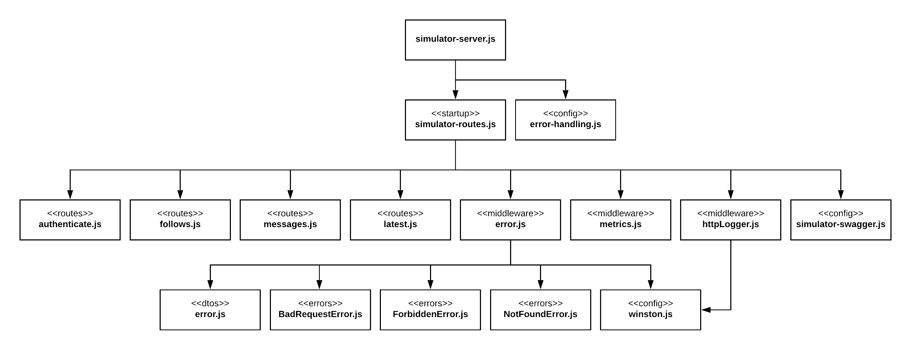  
**Figure 7:** The internal dependencies of the `simulator-server.js`, which is the root of the API. An arrow indicates a `require` relationship. The arrow points at the module that is being required. The stereotypes indicate the file's parent folder.

Figure 8 presents the internal dependencies of the different routes of the simulator API. 

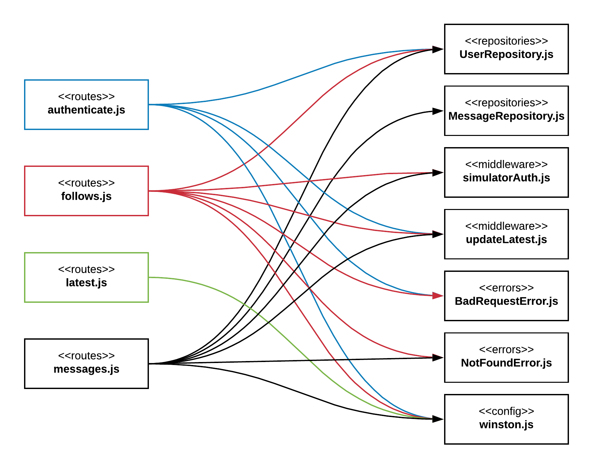  
**Figure 8:** The internal dependencies of the different routes comprising the simulator API. An arrow indicates a `require` relationship. The arrow points at the module that is being required. The stereotypes indicate the file's parent folder.

Figure 9 presents the Sequelize models of the system and how they relate to each other.

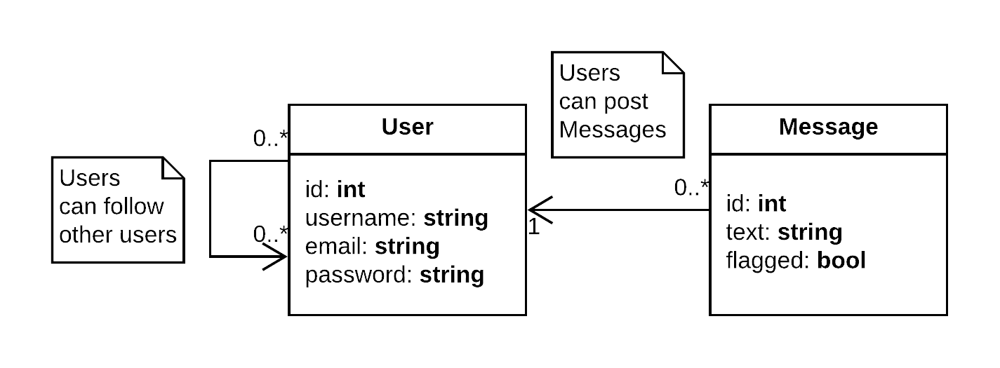  
**Figure 9:** The Sequelize models of the system and how they relate to each other.

Figure 10 presents the models' corresponding repositories and the functions that they expose.

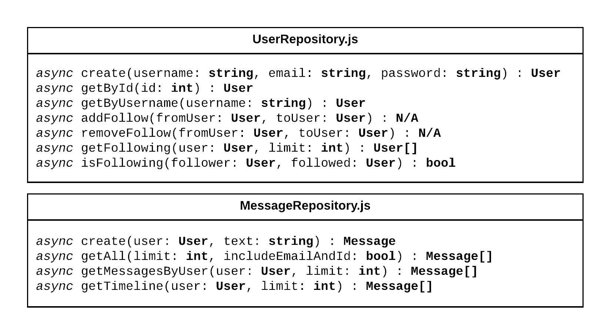  
**Figure 10:** The repositories using the Sequelize models with the functions that they expose.

Figure 11 illustrates the interaction between the different parts of the system in the case where a user's timeline is requested.

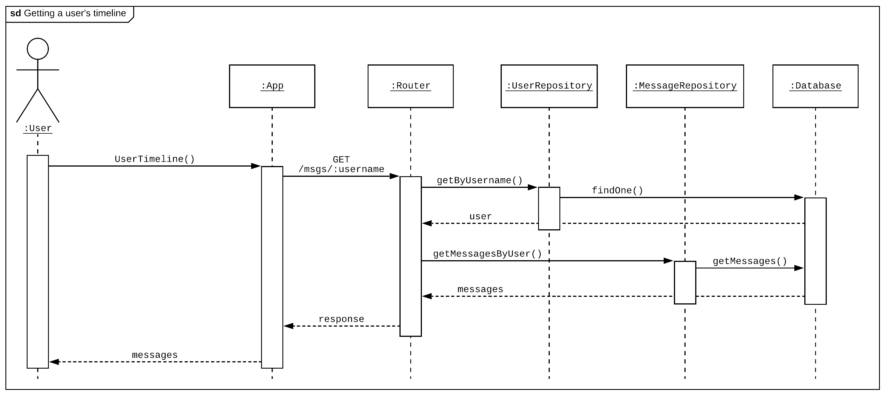  
**Figure 11:** Sequence diagram illustrating the communication between different parts of the system in the case where a user's timeline is requested.

## Dependencies

In this section every tool or piece of software that the different parts of the system depend on is listed. The `^` symbol in the version declarations means "compatible with version". The symbol and its meaning stem from the [semantic versioner](https://docs.npmjs.com/misc/semver.html) that `[npm](https://www.npmjs.com/)`, which is the package manager used for the entire application, uses.

### Front-end

- **`react`** (^16.12.0): JavaScript library used to build the front-end.
    - `react-dom` (^16.12.0): Enables `react` to interact with the DOM.
    - `react-jss` (^10.0.4): Enables JSS integration with `react`.
    - `react-router-dom` (^5.1.2): Enables routing in the app.
    - `react-scripts` (^3.3.1): Includes scripts and configuration used by `create-react-app` bootstrapping tool (which is not included in this list as it is a one-off and not required for running the app).
    - `prop-types` (^15.7.2): Enables runtime type checking of `react` props.
- **`md5`** (^2.2.1): Used to hash the users' emails for getting their Gravatars.

### Back-end

- **`node`** (^13.08.0): Runtime environment for the back-end.
- **`express`** (^4.17.1): Web application framework. Used to listen for incoming HTTP requests and is essential for the backend.
    - `body-parser` (^1.19.0): Enables parsing of the bodies of incoming HTTP requests.
    - `cors` (^2.8.5): Enables resource sharing between the front-end and the back-end.
    - `express-async-errors` (^3.1.1): Enables better error handling when using `async/await` syntax.
- **`winston`** (^3.2.1): Enables logging in different levels, e.g., `error`, `warning`, `info`, which enables searching logs by their type.
- **`sequelize`** (^5.21.4): ORM used to simplify the interaction between the back-end and the database. Abstracts the underlying SQL queries away.
- **`bcrypt`** (^3.0.8): Used to encrypt passwords in the database.
- **`prom-client`** (^12.0.0): Client for the monitoring software *Prometheus*.
    - `express-prom-bundle` (^6.0.0): Provides `express`-related metrics.
- **`swagger-jsdoc`** (^3.5.0): Tool to generate *Swagger* (OpenAPI) documentation using JSDoc.
    - `swagger-ui-express` (^4.1.3): Used to generate a documentation UI for the `express` API.
- **`pg`** (^7.18.1): Client used to interact with the PostgreSQL database.
    - `pg-hstore` (^2.3.3): Used by `pg` to serialize data when communicating with the database.
- **`yargs`** (^15.1.0): Used for parsing and acting on command line arguments in the `flag-tool.js`.

### **Testing**

- **`jest`** (^25.1.0): Test runner and framework used to create atomic unit tests that can easily be run via GitHub Actions and on our local development machines.
- **`supertest`** (^4.0.2): Used to test that responses to HTTP requests are as expected.
- **`testdouble`** (^3.13.0): Used to mock parts of the application, namely the `sequelize` repositories, such that unit tests can be truly atomic.
    - `testdouble-jest` (^2.0.0): Allows for use of `testdouble` in `jest` tests.
- **`eslint`** (^6.8.0): Code quality tool. Ensures a consistent coding style and syntax by *linting* the code.
    - `eslint-config-airbnb-base` (^14.0.0): Provides the set of linting rules that *Airbnb* uses. Used as a base of rules to build upon.
    - `eslint-plugin-import` (^2.20.1): Provides linting rules for import syntax.
    - `eslint-plugin-jest` (^23.8.1): Provides linting rules for `jest`.
    - `eslint-plugin-testdouble` (^1.0.1): Provides linting rules for `testdouble`.
    - `eslint-plugin-jsx-a11y` (^6.2.3): Provides linting rules for accessibility of JSX elements.
    - `eslint-plugin-react` (^7.18.3): Provides linting rules for `react`.
    - `eslint-plugin-react-hooks` (^1.7.0): Provides linting rules for `react` hooks.

### Operations

- **`docker`** (^19.03.7): Used to run the different components in containers. The engine also include *swarm mode*, which we utilize to orchestrate clusters of containers.
- **`docker-compose`** (^1.25.4): Used to orchestrate the different containers on a single host machine.
- **`git`** (^2.26.2): Used to version control the code.
- **`grafana`** (^5.4.3): Used to visualize monitoring results from Prometheus.
- **`elasticsearch`** (^7.6.0): Used for storing and searching through logs (ELK).
- **`logstash`** (^7.6.0): Used for collecting and processing raw logs (E**L**K).
- **`kibana`** (^7.6.0): Used for visualizing processed logs in Elasticsearch (EL**K**).
- **`filebeat`** (^7.6.0): Used to ship logs from the Production VM to `logstash`.
- **`terraform`** (^0.12.24): Used to provision and configure the host machines in the Docker Swarm setup.
- **`vagrant`** (^2.2.7): Used to define our Production VM in reproducible and portable code (see [Vagrantfile](https://github.com/DevOps-Drengene/DevOps-Project/blob/master/Vagrantfile)).
- **`vagrant-digitalocean`** (^0.9.3): `vagrant` plugin that enables management of DigitalOcean Droplets.
- **`make`** (^3.81): Build automation tool used to make spinning up the application and run tests on our local development machines (see [Makefile](https://github.com/DevOps-Drengene/DevOps-Project/blob/master/Makefile)).
- **GitHub**: Used for our distributed Git version control system. We will elaborate on the use of GitHub in the *Process Perspective* chapter.
- **GitHub Actions**: Used to run our CI/CD pipeline. We will elaborate on the use of GitHub Actions in the *Process Perspective* chapter.
- **SonarCloud**: Used to statically analyze our code. We will elaborate on the use of SonarCloud in the *Process Perspective* chapter.

## Monitoring

### Infrastructure and Application Monitoring

For our whitebox infrastructure and application monitoring setup, we used a combined setup of:

- *Prometheus* to systematically pull:
    1. System metrics from the Production VM using a [Node exporter](https://github.com/prometheus/node_exporter). These metrics include CPU and RAM usage, used disk capacity of the database Block Storage volume, and uptime for deployed Docker containers.
    2. Application-level metrics from the `Webserver` subsystem. These metrics include the count of HTTP requests to each endpoint, the internal processing time of each request, and how many requests resulted in errors. We instrumented the application code with a Node library called *[express prometheus bundle](https://github.com/jochen-schweizer/express-prom-bundle)* for Express to gather such metrics.
- *Grafana* to visualize the metrics gathered from Prometheus and the production database in organized dashboards.

Below, the different sections of our Grafana dashboard is shown.

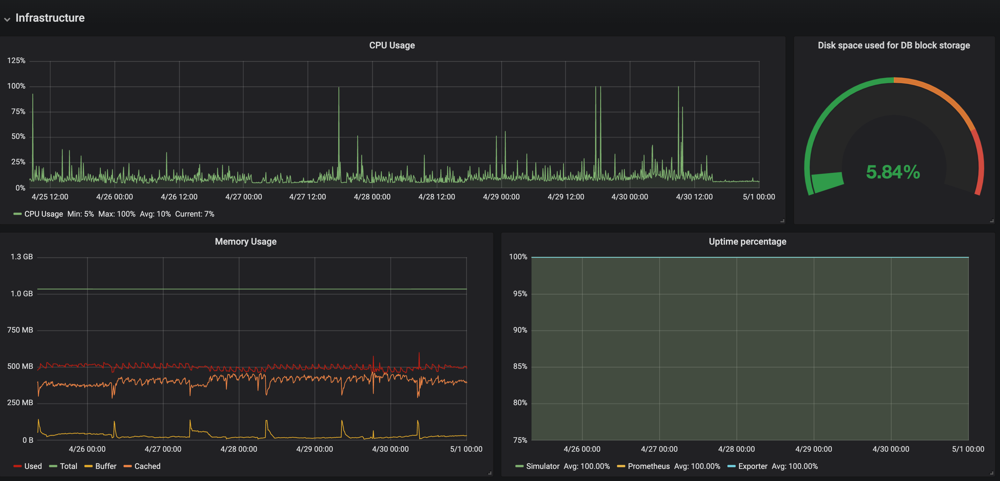  
**Figure 12:** Infrastructure metrics

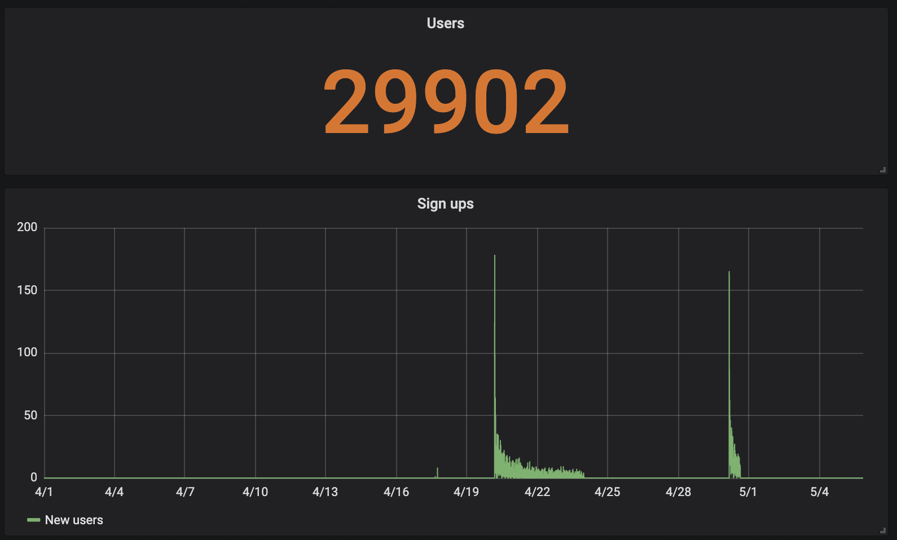  
**Figure 13:** Number of user registrations at given times including the current amount.
We included this section to also visualize metrics that deliver business value, and not just system metrics that provide feedback on current running system and its quality of service.

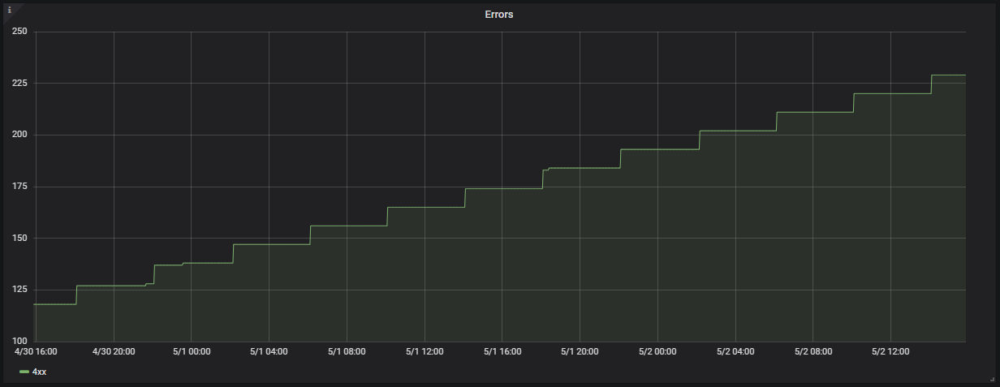  
**Figure 14:** The amount of errors the `Webserver` subsystem has returned in total (application-level metric).

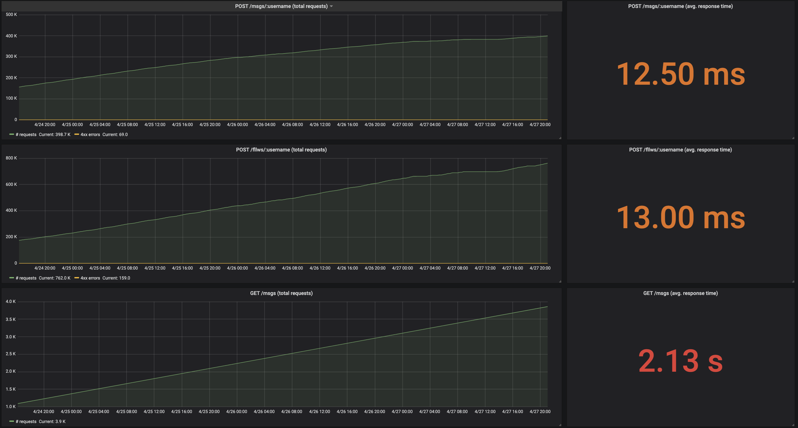  
**Figure 15:** The number of requests (the green line), errors (the orange line), and average internal processing time (the number in the right panels) of each request for each endpoint of `Webserver` subsystem (application-level metric).

### SLA Monitoring

We used the tool [*Synthetics*](https://docs.datadoghq.com/synthetics/) on the cloud monitoring service *[Datadog](https://www.datadoghq.com/)* to test if our system could live up to the metrics (monthly uptime percentage, average response times, and error rates) defined in our [SLA](https://github.com/DevOps-Drengene/DevOps-Project/blob/master/sla.md). This type of monitoring can be categorized as active blackbox monitoring.

Every five minutes Datadog sends valid requests to all endpoints specified in the SLA from three locations in Europe (Frankfurt, Ireland, and London). For each request, the tool then asserts that a successful response is received and the response time is within the accepted range as specified in the SLA. A screenshot of such a test in Synthetics is shown in Figure 16 below.

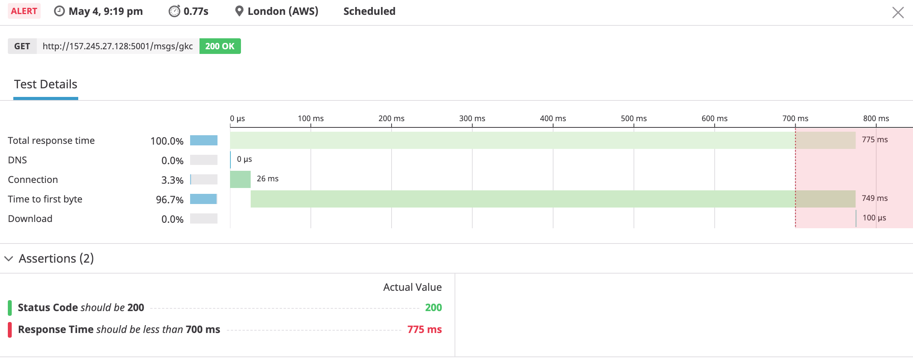  
**Figure 16:** Failed Synthetics test in Datadog.

In this specific test for one of the endpoints, the test failed as the response was not delivered within the accepted timespan of 700 milliseconds. Below, our monitoring dashboard in Synthetics with metrics listed from April 1st to May 4th is shown in Figure 17 below.

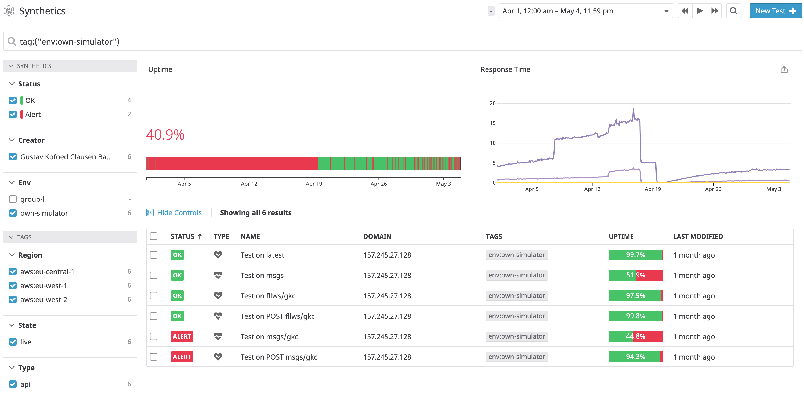  
**Figure 17:** Synthetics dashboard.

Whenever a test failure occurs in Synthetics, it marks it as downtime. That is the reason why the uptime percentage is extremely low even though the system was able to process the requests - just not within reasonable time as specified in the SLA. It is worth noting that it is only two endpoints (`/msgs` and `/msgs/:username`) that have poor uptime and that drag the total uptime down - we actually do quite well on all the others. We became aware of the performance issue back in end of March, as shown in [this GitHub issue](https://github.com/DevOps-Drengene/DevOps-Project/issues/161), and we tried to implement a optimization fix, as shown in [this GitHub Pull Request](https://github.com/DevOps-Drengene/DevOps-Project/pull/166), but it did not increase the performance. We observed that the internal processing time of the system for each request to the `/msgs/` endpoints increased as more data (like users, messages, and user follows) was stored in the database. We have investigated the issue several times (investigating e.g. database indices and Sequelize tweaks) but we never managed to find a solution.

A test failure also triggers an alert which Datadog notifies us about for awareness of failures. We initially configured Datadog to send the alerts to a dedicated *Slack* channel, but that over time caused too much disturbance as many alerts were generated in the beginning. A screenshot of Slack where the alert messages from Datadog was sent to is shown in Figure 18.

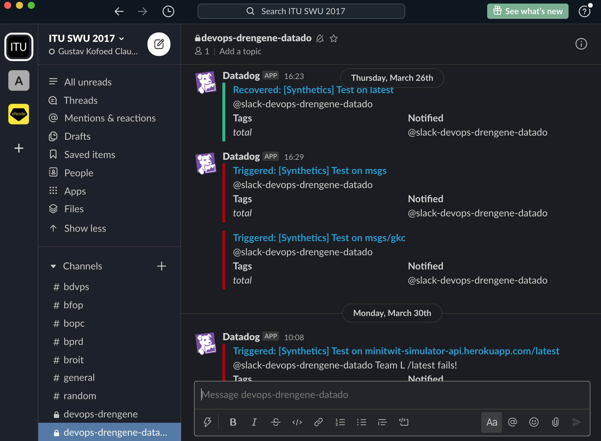  
**Figure 18:** Synthetics test failure alert sent as message to our Slack channel.

Rather than being notified about alerts on Slack, we configured Datadog to send daily emails of all triggered and recovered alerts of the given day to one to our group members. An example of such mail is shown in Figure 19.

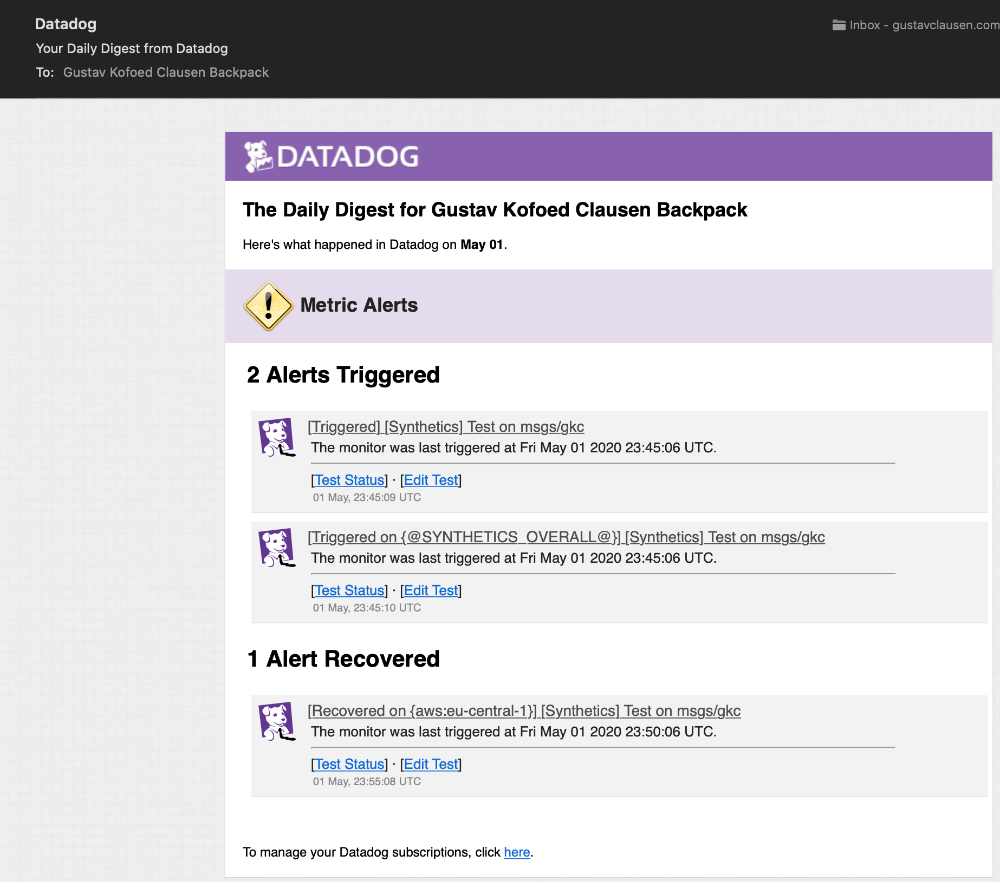  
**Figure 19:** Status on daily Synthetic test results sent as mail.

## Logging

Our log aggregation setup is based on the [Elastic Stack](https://www.elastic.co/what-is/elk-stack) (*[Elasticsearch](https://www.elastic.co/elasticsearch/)*, *[Logstash](https://www.elastic.co/logstash)*, *[Kibana](https://www.elastic.co/kibana)*) stack, including *[Filebeat](https://www.elastic.co/beats/filebeat)*. The entire log aggregation process is illustrated with a sequence diagram shown in Figure 20.

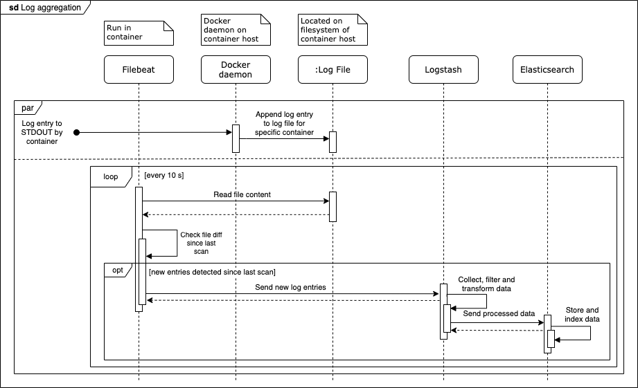  
**Figure 20:** Log aggregation illustrated with an UML sequence diagram.

All components of MiniTwit running in containers on the Production VM writes logs as a formatted log statement to standard output (STDOUT). Our application uses [`winston`](https://github.com/winstonjs/winston) to include a logging/severity level of all logs and to format the log messages as JSON in a standard format.

As highlighted in the code snippets below, a call to a function of `winston` with the name of the desired logging level creates a log statement in STDOUT.

```js
// Source: [https://github.com/DevOps-Drengene/DevOps-Project/blob/master/backend/src/routes/latest.js](https://github.com/DevOps-Drengene/DevOps-Project/blob/master/backend/src/routes/latest.js)

...
router.get('/', async (_req, res) => {
  > **winston.info('latest was called!');**
  return res.send({ latest: global.latestCounter });
});
...
```

```js
// Source: [https://github.com/DevOps-Drengene/DevOps-Project/blob/master/backend/src/middleware/error.js](https://github.com/DevOps-Drengene/DevOps-Project/blob/master/backend/src/middleware/error.js)

...
module.exports = (err, req, res, next) => {
  if (err instanceof URIError) {
    **> winston.error(`400: ${err.message}`);**
    res.status(400).send(new Error('Malformed params in URL. Ensure no special characters are used.'));
  } else if (err instanceof BadRequestError) {
    **> winston.error(`400: ${err.message}`);**
    res.status(400).send(new Error(err.message));
  } else if (err instanceof ForbiddenError) {
    **> winston.error(`403: ${err.message}`);**
    res.status(403).send(new Error(err.message));
  } else if (err instanceof NotFoundError) {
    **> winston.error(`404: ${err.message}`);**
    res.status(404).send(new Error(err.message));
  } else {
    **> winston.error(`500: ${err.message}`);**
    res.status(500).send(new Error(err.message));
  }

  next();
};
...
```

```json
{"message":"latest was called!","level":"info"}       // Info log
{"message":"404: User gkc not found","level":"error"} // Error log
```

To retrieve the log entries of the Docker containers, the logging driver of the Docker daemon is configured to write all log entries in STDOUT from all containers to log files for the specific container on Production VM's filesystem.

Filebeat is then used to continuously check for new entries in the log files and ship all new entries, in a push-based manner, to Logstash. Logstash then collects, filters, and transforms the logs into storable data which is sent to Elasticsearch to be stored there. As seen in [this configuration file](https://github.com/DevOps-Drengene/docker-elk/blob/master/logstash/pipeline/logstash.conf), Logstash is configured to only process logs from the `Webserver` subsystem and transform the JSON data of the logs into data fields.
Furthermore, Kibana is used to query and visualize the data stored in Elasticsearch.

The deployment of the different components of our logging setup is visualized in the deployment diagram shown in Figure 21.

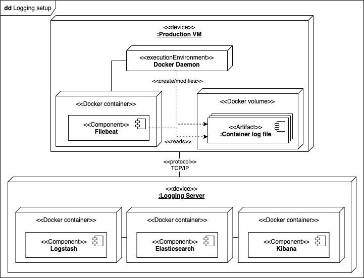  
**Figure 21:** Deployment of components and artifacts used in logging setup illustrated with an UML deployment diagram.

### What is Logged in the Application?

We log every received HTTP request to the `Webserver` subsystem to monitor all incoming traffic to the system. This log includes among other things the URL and payload of the request as well as the IP of the client.

The screenshot from Kibana, as shown below in Figure 22, shows a query for all logged requests from the simulator (IP: 142.93.104.18) to our endpoint.

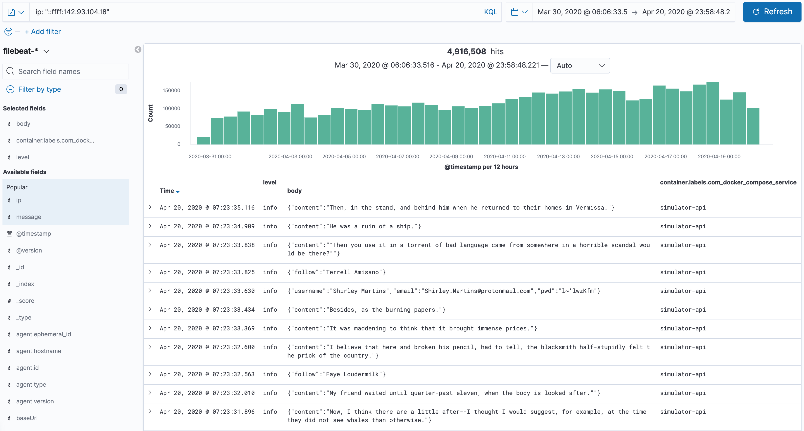  
**Figure 22:** Kibana dashboard listing all logs of received HTTP traffic from simulator from March 30 to April 20 2020.

Furthermore, we log every error that occurs as a result of bad client requests (e.g., authorization errors and requests for non-existing users) and internal errors to spot errors and suspicious client requests.

The screenshot from Kibana, as shown below in Figure 23, shows a query for all logged errors that occurred as a result of an internal error. In these cases, the application could not connect to the database.

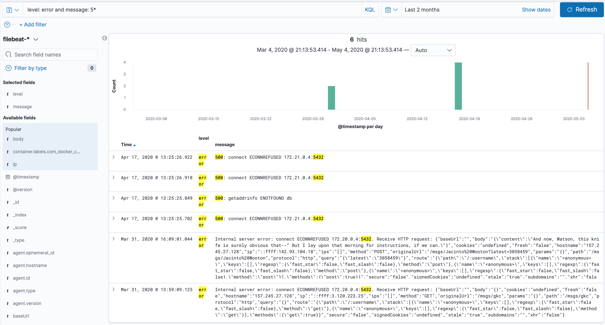  
**Figure 23:** Kibana dashboard listing all logs of internal errors in `Webserver` subsystem.

## Current State of our Systems

All systems are fully functional. They were turned off as the report was handed in, but they will be turned on again a few days before the exam for a live demo.

### Static analysis

For static code analysis, we have used [*ESLint*](https://eslint.org/) and [*SonarCloud*](https://sonarcloud.io/).

ESLint has been used to ensure consistent JavaScript syntax throughout the codebase by *linting* the code, i.e., checking that everything lives up to the ruleset. In the current state of the system, there are no linting errors. Our automated test on GitHub prevents code with linting errors to be merged into our `master` branch. If there are any linting errors in the code of a pull request, the code is rejected. As such, code on `master` *always* lives up to the linting rules.

SonarCloud has been used as our *quality assessment system.* SonarCloud is based on SonarQube, which is an open-source platform developed by SonarSource for continuous inspection of code quality to perform automatic reviews with static analysis of code to detect bugs, code smells, and security vulnerabilities.

The current state of the system has no bugs, but it has 5 code smells. All five code smells are from the course's original Python implementation of tests for MiniTwit. We do have some duplication, however this is only across our testing files. We have not prioritized refactoring the tests to eliminate duplications. A screenshot of the SonarCloud dashboard can be seen in Figure 24.

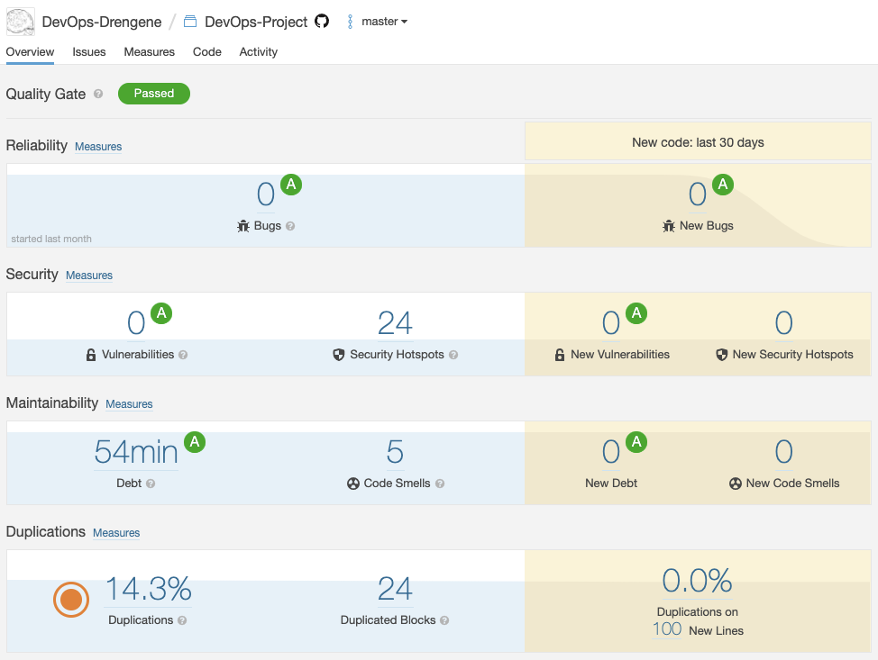  
**Figure 24:** SonarCloud dashboard showing the status of the latest analysis of our repository.
